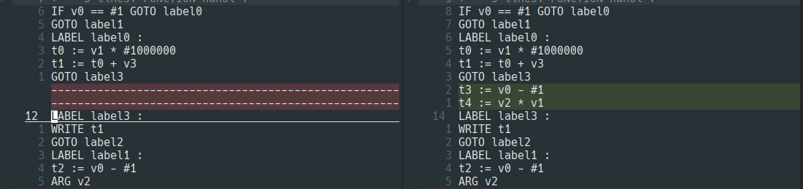

# Phase 3

## Basic
## Optional Features
##### Struct
Structure variables can appear in the program, and they can be declared as function parameters. Still, assignment
operations will not be directly performed on a structure variable.
Test: 
```
struct Student {
    int ID;
    int score;
};

int main() {
    struct Student x, y;
    x.ID = 0;
    x.score = 90;
    y.ID = 1;
    y.score = 100;
    write(x.ID);
    write(x.score);
    write(y.ID);
    write(y.score);
    return 0;
}
```
Result:
```
FUNCTION main :
DEC v0 8
DEC v1 8
t0 := &v0
*t0 := #0
t2 := &v0 + #4
*t2 := #90
t4 := &v1
*t4 := #1
t6 := &v1 + #4
*t6 := #100
t8 := &v0
t9 := *t8
WRITE t9
t10 := &v0 + #4
t11 := *t10
WRITE t11
t12 := &v1
t13 := *t12
WRITE t13
t14 := &v1 + #4
t15 := *t14
WRITE t15
RETURN #0
```
## IR optimize

### Unreachable code elimination
1. 判断块前是否有无条件跳转的 `GOTO` 指令，如果有则不可达。不可达块中出现 `LABEL` 则认为该不可达块结束，后面的块恢复为可达。

2. `IF` 指令跳转如果恒为真，则检查跳转的label,如果未定义，则后方的块都不可达知道找到label定义，然后删除 `IF` 和对应label。否则不处理。（数据流分析好麻烦，摆了）

### Constant folding
同上，数据流分析摆了